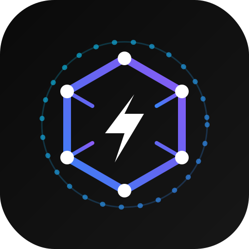
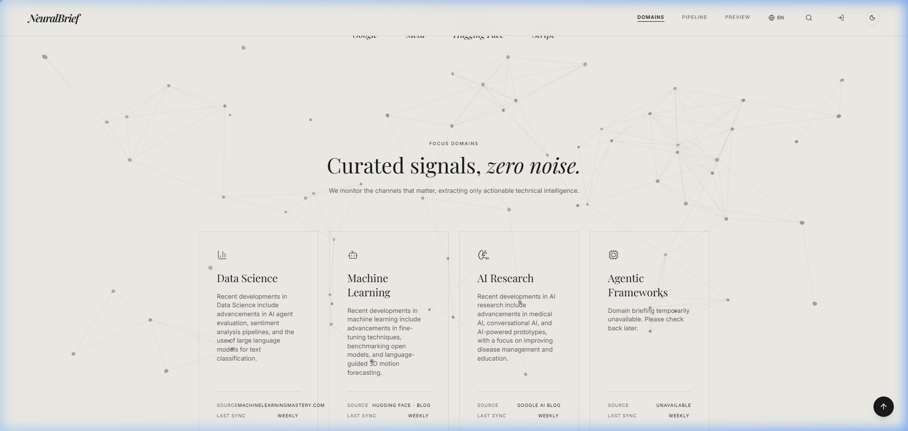
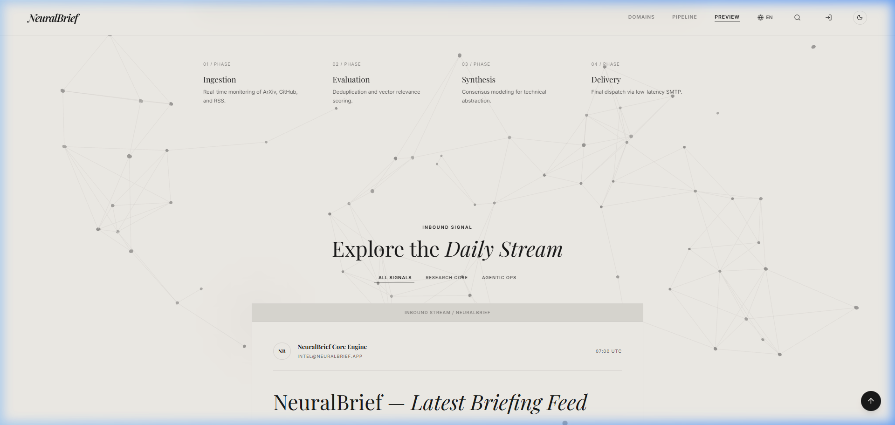
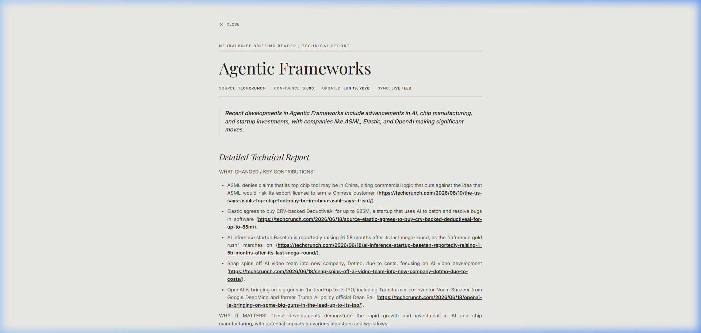

<div align="center">
  
  <h1>⚡ NeuralBrief</h1>
  <h3>Your personalized daily briefing on AI, tech, and competitors — delivered to your Gmail every morning.</h3>

  <p>
    <a href="https://neuralbrief-be395.web.app/" target="_blank">
      
    </a>
  </p>

  <p>
    <a href="https://react.dev"></a>
    <a href="https://www.typescriptlang.org"></a>
    <a href="https://firebase.google.com"></a>
    <a href="https://ai.google.dev"></a>
    <a href="https://tailwindcss.com"></a>
  </p>
</div>

---

## 🌐 Live Platform

**Access the live web application here:** [https://neuralbrief-be395.web.app/](https://neuralbrief-be395.web.app/)

---

## 🧠 What is NeuralBrief?

NeuralBrief is a premium AI-powered intelligence platform built for founders, engineers, and analysts who need to stay current without spending hours reading the news. 

Every night, a four-agent pipeline powered by **Gemini AI** scrapes hundreds of trusted tech sources, filters the noise, generates crisp two-to-three sentence summaries, and delivers a beautifully formatted digest to your Gmail inbox by 7 AM. You choose your topics once — AI, cybersecurity, SaaS, cloud, startups, competitors — and wake up to exactly the signal you need, nothing more. 

Built on a modern serverless stack, NeuralBrief features a highly interactive, state-of-the-art glassmorphic user interface designed to feel like a live intelligence command center.

---

## 📸 Platform Showcase

### The Bento Command Center
An asymmetrical, responsive Bento Grid displaying live streams of intelligence domains. No more carousels—everything is accessible at a single glance with unified metrics.
<br/>


### Holographic AI Data Plate
A premium, glassmorphic card interface featuring an interactive, mouse-tracking radial glow that illuminates the content beneath your cursor. Includes animated SVG confidence gauges and pulsing "Live Update" badges.
<br/>


### Rich Technical Reports
Every domain card expands into a detailed technical report. Even when the live feed is unavailable, the system gracefully falls back to beautifully simulated architectural overviews and key takeaways.
<br/>


---

## ✨ Key Features

- **Holographic Glassmorphism UI** — Deep blur, animated borders, interactive spotlights, and unified metrics across all dashboards.
- **Bento Grid Architecture** — All intelligence domains are arranged in a sleek, asymmetric grid for maximum visibility.
- **Four-Agent AI Pipeline** — Scraper, Filter, Summary, and Email agents orchestrated by Antigravity 2.0 run sequentially every night at 07:00 UTC with full observability.
- **Gemini Flash Summarization** — Every article is distilled to two-to-three sentences using Gemini AI.
- **Relevance Scoring** — The Filter Agent assigns each article a 0–1 relevance score against your selected topics. Off-topic content never reaches your inbox.
- **Gmail-Native Delivery** — Digests are sent via the Gmail API, rendering beautifully in Gmail's interface.
- **Multilingual UI** — Full interface translations in English, Hindi, Spanish, French, Simplified Chinese, and Korean.

---

## 🛠️ Tech Stack

| Category | Technology | Purpose |
|---|---|---|
| **Frontend Framework** | React 18 | UI component model and rendering |
| **Language** | TypeScript 5 | Type-safe frontend and backend code |
| **Styling** | Tailwind CSS v4 | Utility-first responsive styling |
| **Animations** | Framer Motion | Deep glassmorphism, mouse-tracking spotlights |
| **Authentication** | Firebase Auth | One-click Google sign-in / session management |
| **Database** | Firestore | User preferences, bookmarks, digest configs |
| **Backend** | Express.js (Node.js 20) | REST API and cron endpoint |
| **AI Engine** | Gemini Flash | Article filtering and summarization |
| **Agent Orchestration**| Antigravity 2.0 | Multi-agent pipeline coordination |
| **Email Delivery** | Gmail API (OAuth2)| Sending personalized digests to users |
| **Frontend Hosting** | Firebase Hosting | CDN-backed static hosting |
| **Backend Hosting** | Google Cloud Run | Serverless containerized Express server |

---

## 🤖 The Agent Pipeline

Every morning at 07:00 UTC, Cloud Scheduler fires a POST to the backend's `/api/cron/digest` endpoint. Four agents then run in sequence:

```text
🕷️  Scraper Agent
        │  Crawls RSS feeds, tech blogs, and news APIs.
        │  Outputs: NewsItem[]
        ▼
🧹  Filter Agent
        │  Scores articles for relevance (0–1) against user topics.
        │  Removes duplicates. Outputs: FilteredNewsItem[]
        ▼
✍️  Summary Agent
        │  Calls Gemini Flash to generate 2–3 sentence summaries.
        │  Categorizes each item. Outputs: DigestSection[]
        ▼
📧  Email Agent
        │  Assembles DigestPayload, renders the email template.
        └─ Sends via Gmail API to each subscribed user's inbox.
```

---

## 🚀 Quick Start (Local Setup)

```bash
# 1. Clone the repository
git clone https://github.com/shu1919284-code/NeuralBrief.git
cd neuralbrief

# 2. Install frontend dependencies
npm install

# 3. Install backend dependencies
cd server && npm install && cd ..

# 4. Set up environment variables
cp .env.example .env
# Open .env and fill in all required values

# 5. Start the development server
npm run dev
# Frontend: http://localhost:5173
# Backend:  http://localhost:3001
```

---

## 📄 License

This project is licensed under the [MIT License](LICENSE).